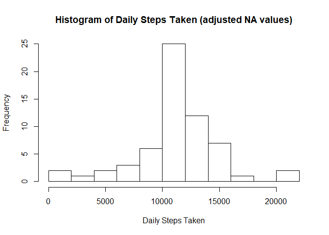

## Loading and preprocessing the data

```r
library(ggplot2)
library(reshape2)
activity<-read.csv("activity.csv")
activity<-activity[complete.cases(activity),]
```

## What is mean total number of steps taken per day?
[]("PA1_template_files/figure-html/mean steps-1.png")<!-- -->

```
## [1] "Mean steps equals =  10766.1886792453"
```

```
## [1] "Median steps equals =  10765"
```


## What is the average daily activity pattern?
<!-- -->

```
## [1] "Maximum average activity occurs at  835  taking a value of  206.169811320755  average steps!"
```


## Imputing missing values

```
## [1] "There are  2304  NAs"
```
### Reconstructing the Data

```r
activity2<-read.csv("activity.csv")

##Computing the mean for each Interval in the day
intervalsteps<-with(activity,tapply(steps, interval, mean))

##Adding an extra column to the dataset corresponding to the mean of the specified interval
activity2$extr<-intervalsteps

##If there is an NA value, the code replaces it with the mean (from the 4th column)
activity2$steps<-ifelse(is.na(activity2$steps),activity2$extr,activity$steps) 
```

<!-- -->

```
## [1] "Mean steps equals =  11092.1394989174"
```

```
## [1] "Median steps equals =  10766.1886792453"
```

## Are there differences in activity patterns between weekdays and weekends?
<!-- -->

